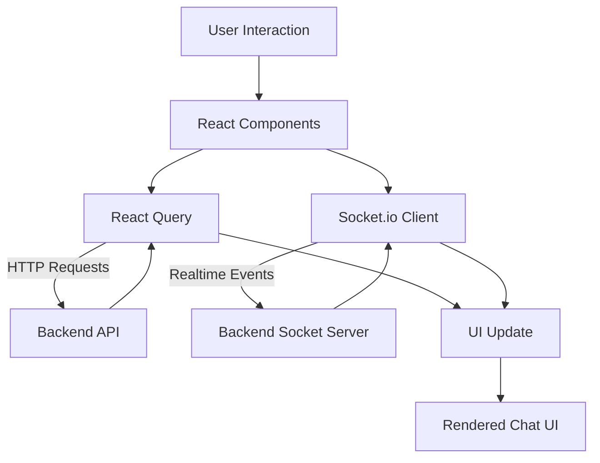

# VHub Frontend – Real-Time Chat Application

A modern, scalable **real-time chat frontend** built with **React, Vite, Tailwind CSS, React Query, and Socket.io**, delivering seamless messaging, live updates, and an optimized user experience.

---

## Overview

VHub frontend provides:

- Real-time messaging with WebSockets
- Optimistic UI updates (instant message rendering)
- Efficient data fetching with React Query
- Infinite scrolling & pagination
- Message search with highlighting
- Smart caching & state synchronization
- Modern UI with Tailwind + shadcn

---

## Architecture

```id="arch1"
User (Browser)
     │
     ├── REST API (Axios + React Query)
     │       ├── Auth
     │       ├── Messages
     │       ├── Conversations
     │       └── Users
     │
     └── WebSocket (Socket.io Client)
             ├── Send / Receive Messages
             ├── Typing Indicators
             ├── Reactions
             └── Read Receipts
```

---

## Frontend Data Flow



---

````

## Tech Stack

| Layer        | Technology |
|-------------|-----------|
| Framework   | React 19 :contentReference[oaicite:0]{index=0} |
| Build Tool  | Vite :contentReference[oaicite:1]{index=1} |
| Styling     | Tailwind CSS + shadcn/ui :contentReference[oaicite:2]{index=2} |
| State Mgmt  | React Query :contentReference[oaicite:3]{index=3} |
| HTTP Client | Axios :contentReference[oaicite:4]{index=4} |
| Realtime    | Socket.io Client :contentReference[oaicite:5]{index=5} |
| UI Utils    | clsx + tailwind-merge :contentReference[oaicite:6]{index=6} |

---

## Folder Structure

``` id="struct1"
src/
│
├── components/
│   ├── auth/
│   ├── chat/
│   ├── profile/
│   └── ui/
│
├── pages/
│   ├── AuthPage.jsx
│   └── ChatPage.jsx
│
├── services/
│   ├── api.js
│   ├── authApi.js
│   ├── messageApi.js
│   ├── conversationApi.js
│   ├── userApi.js
│   └── uploadApi.js
│
├── hooks/
│   ├── useTheme.js
│   └── useUpload.js
│
├── utils/
│   ├── format.js
│   └── errorHandler.js
│
├── socket/
│   └── socket.js
│
├── App.jsx
└── main.jsx
````

---

## Authentication Flow

- Login/Register handled via API
- Token stored in localStorage
- Axios interceptor attaches token automatically

### Route Protection

- `PublicRoute` → blocks logged-in users
- `ProtectedRoute` → blocks unauthenticated users

---

## Core Features

### 1. Real-Time Messaging

- Uses Socket.io client
- Handles:
  - send-message
  - receive-message
  - typing / stop-typing

---

### 2. Optimistic UI (Advanced)

- Messages appear instantly before server response
- Temporary IDs used (`temp-*`)
- Replaced after server confirmation

---

### 3. Infinite Scroll (Chat History)

- Loads messages page-by-page
- Maintains scroll position correctly
- Prevents jump issues

---

### 4. Message Search

- Debounced search
- Highlights matched text
- Navigation between results

---

### 5. Smart Caching (React Query)

- Conversations → infinite query
- Users → cached query
- Auto refetch on new messages

---

### 6. Online Status

- Real-time updates via socket
- Displays active users

---

### 7. Typing Indicator

- Emits typing events
- Debounced to reduce spam

---

### 8. Emoji & Reactions

- Emoji picker (lazy loaded)
- Real-time reactions update

---

### 9. Image Upload (Cloudinary)

- Uploads via custom hook
- Progress tracking
- Optimistic preview

---

### 10. Theme System

- Light / Dark / System
- Persisted in localStorage

---

### 11. Profile Management

- Update user details
- Delete account
- Uses React Query mutations

---

## Data Flow (Detailed)

### API Flow

````
Component → React Query → Axios → Backend → Response → Cache → UI
``` id="flow1"

---

### ⚡ Realtime Flow
````

Component → Socket.emit → Backend → Socket.broadcast → UI update

```id="flow2"

---

### Optimistic Flow
```

User Action → UI Update (temp message) → Server Response → Replace message

```id="flow3"

---

## API Integration

- Messages → `/messages/:userId` :contentReference[oaicite:19]{index=19}
- Conversations → `/conversations` :contentReference[oaicite:20]{index=20}
- Users → `/users` :contentReference[oaicite:21]{index=21}
- Auth → `/auth/*` :contentReference[oaicite:22]{index=22}

---

## Performance Optimizations

### Lazy Loading
- Emoji picker dynamically loaded
- Chat messages component lazy loaded

---

### Memoization
- React.memo used in components
- Prevents unnecessary re-renders :contentReference[oaicite:23]{index=23}

---

### Debouncing
- Search input optimized
- Typing events throttled

---

### Efficient Rendering
- Flat message list
- Avoids heavy virtualization complexity

---

## Environment Variables

```

VITE_BASE_URL=[http://localhost:5000](http://localhost:5000)
VITE_CLOUDINARY_CLOUD_NAME=your_cloud
VITE_CLOUDINARY_UPLOAD_PRESET=your_preset

````id="env1"

---

## Getting Started

```bash
# Install dependencies
npm install

# Run dev server
npm run dev
````

---

## Deployment

- Configured for SPA routing (Render)
- Uses Vite build system

---

## Future Improvements

- PWA offline support (already partially enabled)
- Push notifications
- Message virtualization (for extreme scale)
- State management with Zustand (optional)

---

## Testing Credentials

- testuser@chat.com
- marco@yahoo.com
- password: password123

## Author

**Vivekananthan S**

---
